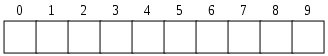

## Introducción {#introducci-n}



En TS un array es en realidad una lista de elementos. Como se ve en la imagen se puede representar como espacios contiguos donde se almacenan valores. Es conveniente tipar de forma que sepamos de qué tipo son los valores que contiene.

Cada elemento del array tiene asignado un índice numérico el cual nos permite acceder al valor. En TS empiezan por 0\. Si conocemos el índice sólo tenemos que escribir el nombre del array y entre corchetes el índice numérico:

```ts
let elementos: string[] = []; // Vacío
elementos[2]; // undefined
```

Si tenemos que recorrer todos los elementos para encontrar algo o, simplemente, para hacer algo con todos ellos necesitamos los bucles. Con el bucle _for_ podemos recorrer el array en el orden que queramos.

Desde el principio:

```ts
for (let i = 0; i < elementos.length; i++) { }
```

Podemos también recorrer el array empezando por el final:

```ts
for(let i = elementos.length - 1; i > 0; i--) { }
```

El índice inicial es el tamaño del array menos uno porque recordemos el índice empieza por 0\. Si tenemos 5 elementos en un array, el quinto tendrá de índice 4.

La clase _Array_ tiene métodos y atributos muy útiles para trabajar con ellos.