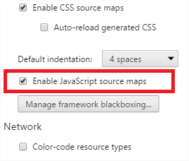

## Depurando TS {#depurando-ts}

Realmente no podríamos depurar directamente TS pues lo que se ejecuta es su traducción en JS. Pero el compilador de TS genera unos archivos _.maps_ que relacionan el código TS con el nativo en JS. De esta forma podemos trazar una correspondencia línea a línea lo que hace que parezca que estamos depurando TS de forma directa.

Para activar esta características en _Chrome_ debemos abrir el navegador y pulsar F12\. En la parte superior derecha de la pestaña que se ha abierto aparece un icono de una sierra dentada como en la imagen:

Pulsamos y nos abrirá otra pestaña en la que debemos marcar la opción _Enable JavaScript source maps:_

Una vez hecho podemos ver el código TS en la pestaña _Sources_ y eligiendo el archivo .ts que queramos.

