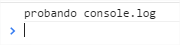

## La consola {#la-consola}

Una herramienta muy importante es la consola. En ella podemos ver los errores de nuestra aplicación así como la línea de código donde ha fallado. Pulsa F12 para abrirla.

Aquí podemos ver que se ha lanzado una excepción que no se ha controlado

Intentamos ejecutar un método de un objeto con valor nulo.

También podemos escribir desde nuestro código. Para utilizarla tenemos a nuestra disposición el objeto _console_ con una serie de métodos. Los más importantes son:

console.log("probando console.log");

console.info("probando console.info");

console.error("probando console.error");

