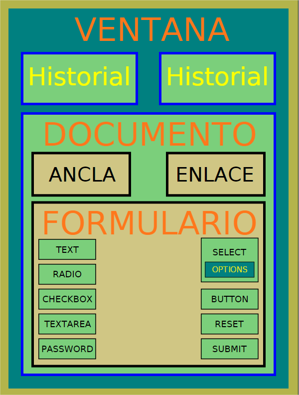

## Introducción {#introducci-n}

La manipulación de las páginas webs es uno de los usos más habituales que se le da a JS. Mediante una API llamada Document Object Model (DOM) podemos moldear a nuestro gusto el contenido de documentos HTML y XML. Esta API nos proporciona una serie de objetos con atributos y métodos muy útiles a la hora de obtener información de la estructura de la página y su contenido.

Documentos XHTML (HTML y XML) se dividen en nodos jerárquicos, de forma que siempre uno está dentro de otro superior. Estos están representados, entre otros, por etiquetas HTML como &lt;a&gt; o &lt;div&gt;. El objeto _window_ es el que está posicionado en la parte superior de esta jerarquía. Éste contiene al objeto _document_ que el que posee los métodos necesarios para la manipulación del DOM.

[http://es.wikipedia.org/wiki/Document_Object_Model](http://es.wikipedia.org/wiki/Document_Object_Model)