## El editor de Microsoft {#el-editor-de-microsoft}

Visual Code es un IDE gratuito de reciente lanzamiento por parte de Microsoft. Su interfaz es sencilla y fácil de manejar. Aún se encuentra en fase “preview” pero es totalmente funcional y el soporte de TypeScript es completo. Para descargarlo debemos ir aquí: [https://code.visualstudio.com/](https://code.visualstudio.com/)

Para empezar, lo más recomendable es referenciar nuestra instalación de TS para que el editor pueda ayudarnos de forma eficaz.

Abrirmos la configuración de usuario:

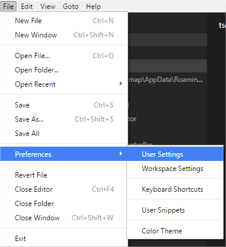

Informando esto "typescript.tsdk". La ruta debe ser donde tengamos instalado TypeScript. En una instalación normal en Windows, la aplicación npm lo instala aquí:

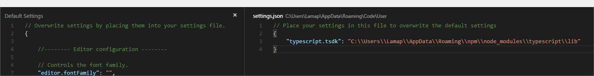

"C:\\Users\\NUESTRO_USUARIO\\AppData\\Roaming\\npm\\node_modules\\typescript\\lib"

Ahora para usarlo simplemente debemos elegir una carpeta en la que trabajar:

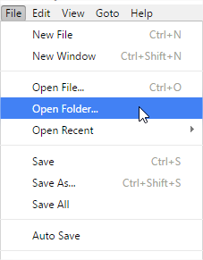

Una vez hecho tendremos esta imagen:

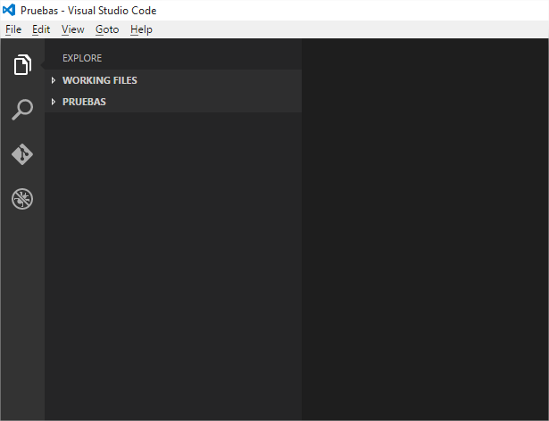

Creamos un archivo de pruebas llamado app.ts y de forma automática tendremos la ayuda del IDE para TypeScript.

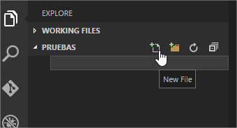

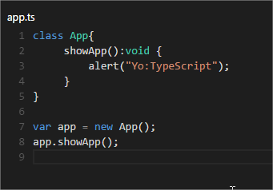


Creamos un archivo con extensión .html y le añadimos la etiqueta _script_ donde el _src_ sea el archivo .js, en este caso app.js.

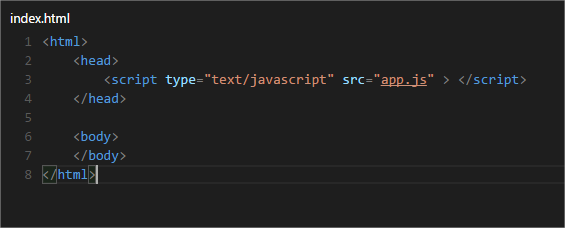

Creamos el archivo _tsconfig.json_ el cual es necesario para configurar qué queremos compilar y cómo. Por ahora sólo añadimos que genere los _sourceMaps._

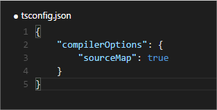

Pulsamos Control + Shift + B y nos saldrá esto:

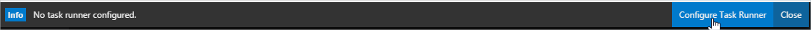

Pulsamos en _Configure Task Runner_ y se creará un archivo _tasks.json_ dentro de la carpeta _.settings_. Éste es necesario para hacer funcionar el “transpiler”. En él sólo borramos esta línea, pues no vamos a introducir argumentos al compilador mediante comandos, sino que vamos a controlarlo con el archivo tsconfig.json.:

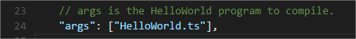

A partir de ahora, cada vez que pulsemos Control + Shift + B, el proyecto se compilará en JavaScript.

app.js compilado desde app.ts:

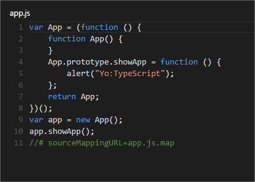

Si queremos ocultar de la lista los archivos .js y .map que se generan, debemos configurarlo.

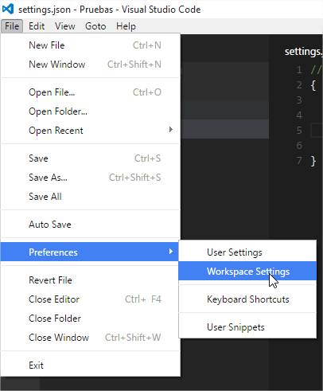

Veremos esto:

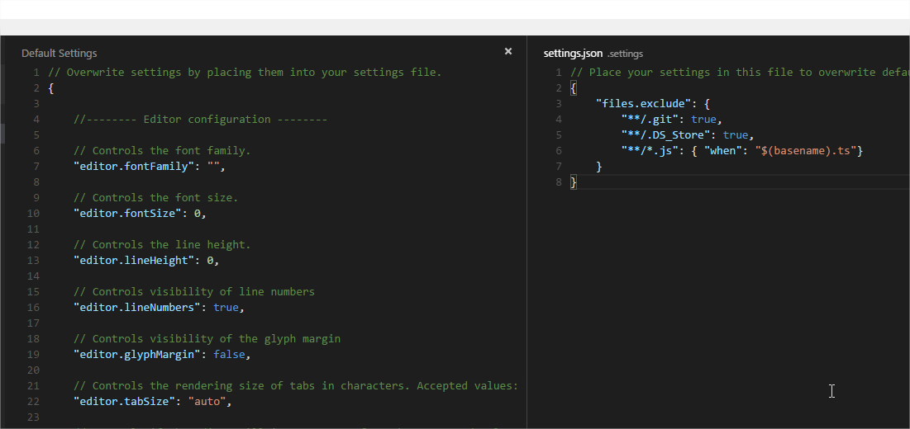

En el archivo de la derecha añadimos:


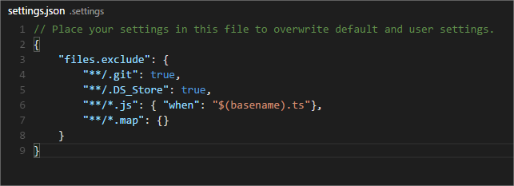

```ts
{"files.exclude" : { 
  "**/.git" : true, 
  "/.DS_Store" : true, 
  "**/*.js" : { "when" : "$(basename).ts" }, 
  "**/*.map" : { } }
}
```

A partir de ahora los archivos .js que tengan su correspondiente .ts no se mostrarán. Además también ocultamos todos los .map.

Resumidamente, a estas alturas, en nuestro proyecto tendremos:

| index.html |
| --- |
| **app.ts** |
| **app.js** |

Si ejecutamos index.html:

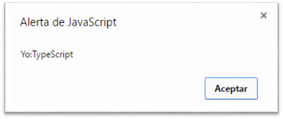


